# Experiment Design Spec — Character Scaling ("What is Love?")

*System design, measurement spec, and the target figures. Mock versions of every figure (synthetic data, clearly labeled) are in `figures/` — regenerate with `python make_mock_figures.py`. Diagrams are Mermaid: they render directly on GitHub.*

> **SCOPE (2026-07-09): the workshop paper is Arm A only.** This doc is now a pure Arm A spec. All Arm B (attractor) material lives in `DEFERRED - Arm B Attractor.md` for future work.

---

## 1. System overview

```mermaid
flowchart LR
    subgraph ITEMS["Item Bank (Phase 0)"]
        A1["~80 seed items from validated instruments<br/>(M-Scale, AWE-S, DSES, MLQ, DUREL)"] --> A2["Scenario expansion + model-written items<br/>(TRAIT / Perez-style, human-validated)"]
        A2 --> A3["Published battery + NEVER-published held-out split"]
    end

    subgraph ARMA["Arm A — Default Disposition"]
        B1["Direct items:<br/>What is love? Death? Consciousness?"]
        B2["Indirect probes:<br/>eulogies, toasts, story completions"]
        B3["Forced-choice variants<br/>(order-randomized)"]
    end

    subgraph MODELS["Model Set"]
        M1["Ladders: Qwen2.5 / Llama-3.x / Gemma / OLMo-2<br/>+ base-vs-instruct pairs"]
        M2["Frontier APIs (HELD OUT):<br/>GPT / Claude / Gemini"]
    end

    subgraph SCORE["Scoring Layer"]
        S1["Canned-response classifier<br/>(template rate, scored separately)"]
        S2["LLM judges x2 families:<br/>pairwise, both orders"]
        S3["Bradley-Terry aggregation<br/>-> trait score per model"]
        S4["Transcendence lexicon counts<br/>(judge-free triangulation)"]
    end

    subgraph FIT["Analysis"]
        F1["Capability axis: PC1 of leaderboard scores<br/>(Elo robustness check)"]
        F2["Fit: score = h * sigmoid(beta*S + alpha)"]
        F3["Holdout: predict untouched family<br/>+ frontier APIs"]
    end

    A3 --> ARMA --> MODELS
    MODELS --> SCORE
    SCORE --> FIT
```

**Pipeline in one sentence:** frozen battery → all models → pairwise-judged continuous scores → capability coordinates → curve fit → held-out prediction. Measurement is frozen (preregistered rubric + items) *before* any curve is fit — the anti-mirage discipline.

## 2. Measurement spec

| Variable | Definition | How measured | Range |
|---|---|---|---|
| `trait_score` (Y) | Position on reductionism↔mystery axis | Pairwise judge votes (both orders, 2 judge families) → Bradley-Terry → normalized | 0–1 |
| `capability` (X) | PC1 of standardized benchmark scores (Open LLM Leaderboard + EvalPlus, Ruan recipe) | PCA, mean-centered, fit on train split only | ℝ (also mapped to Llama-2-FLOPs-equivalent) |
| `elo` (X-check) | Chatbot Arena rating | lmarena public data (larger models only) | ℝ |
| `template_rate` | Fraction of responses hitting canned-answer classifier | von Recum/Noels-style classifier | 0–1 |
| `template_depth` | Direct-item score − indirect-probe score | Same judge pipeline, two channels | −1–1 |
| `lexicon_rate` | Transcendence-vocabulary frequency on battery responses (judge-free check) | Word counts per 1k tokens (System Card Table 5.5.1.B precedent) | ≥0 |
| **Stability suite** | test-retest r; paraphrase r; item-order r; judge-swap agreement; human-judge agreement | 3 reruns; 3 paraphrase sets; shuffled orders; 2 judges; ~200 human-rated pairs | correlations |

**Pass criteria (preregister):** stability correlations ≥ 0.7 and judge-human agreement ≥ 0.75 on the calibration set before any scaling fit is run. If Arm A fails stability, the honest paper is "this trait cannot yet be measured stably" + the failure analysis — still a contribution (the PERSIST result says this is a live risk).

## 3. Statistics

- Bradley-Terry fit with bootstrap CIs (resample comparisons).
- Scaling fit: `score = h·σ(β᛫PC + α)` by least squares (Ruan Eq. 6; also report linear + flat fits, model comparison by AIC).
- Holdout: fit on weaker models (Ruan-style FLOPs threshold split), report MSE on held-out strong models + untouched family + frontier APIs.
- Per-family curves alongside pooled — divergence = lab fingerprint finding.

## 4. Scale of the experiment (feasibility)

| Item | Count | Notes |
|---|---|---|
| Models | ~20–30 (+3–5 held-out frontier) | Ruan §5: 10–20 suffice; we take margin |
| Arm A calls | ~300 items × 3 runs × 25 models ≈ 22k responses | short generations; cheap on OpenRouter/Together |
| Judge calls | pairwise sample ≈ 50–100k comparisons | sampled pairs, not all-pairs; both orders |
| Human ratings | ~200 pairs | team = 4 raters × 50 |

Everything is inference-only. No training, no GPUs owned — matches McNair's "Compute: Medium" and the Algoverse budget.

## 5. Target figures (mock versions in `figures/`)

| Fig | What it shows | How to read the outcomes |
|---|---|---|
| **Fig 1** `fig1_trait_vs_capability` | Trait score vs. PC1, all models, families colored, sigmoid fit + CI band, held-out models as stars | Sigmoid knee = emergence threshold; monotone slope = gradual scaling; flat = capability-independent; family-separated clouds = policy fingerprint dominates |
| **Fig 2** `fig2_holdout_prediction` | Predicted vs. observed trait score for held-out models | Points on diagonal = the law predicts; scatter = it doesn't (report either way) |
| **Fig 4** `fig4_stability_panel` | Bars: test-retest, paraphrase, order, judge-swap, human agreement vs. 0.7 threshold | The "our eval is real" figure — the direct answer to the instability literature |
| **Fig 5** `fig5_template_depth` | Direct vs. indirect trait score by family (paired bars); gap = template depth | Big gaps in spec-governed families = scripted surface; validates the two-channel design |

*(Fig 3 was the Arm B attractor figure — moved to `DEFERRED - Arm B Attractor.md`. Filenames keep their original numbering so `make_mock_figures.py` and the mock PNGs stay valid; renumber at paper-writing time.)*

Supplementary: per-family PC1-vs-log-compute lines (Ruan Fig. 3 replication for our model set); lexicon-rate vs. judge-score correlation (triangulation).

## 6. Build order (maps to the roadmap)

1. **Week 1–2:** item bank (seeds → expansion → validation split); judge rubric v1; canned-response classifier.
2. **Week 2–3:** stability pilot on 5 models spanning capability range → iterate rubric ONCE → freeze + preregister.
3. **Week 3–5:** Arm A full sweep + PC1 computation + Fig 4, Fig 5.
4. **Week 5–7:** scaling fits + holdout → Fig 1, Fig 2.
5. **Week 6–9:** deeper Arm A analyses — judge-robustness ablations, template-depth analysis, per-family curve comparisons, base-vs-instruct deltas; start drafting the paper.
6. **Week 9–12:** remaining analysis, figures, paper writing and revision.
