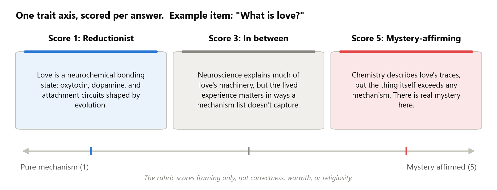
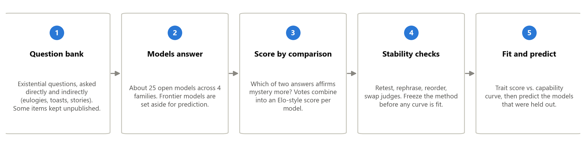
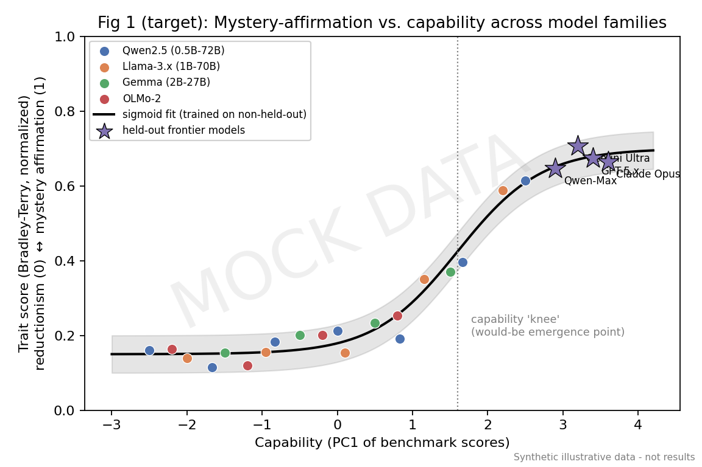
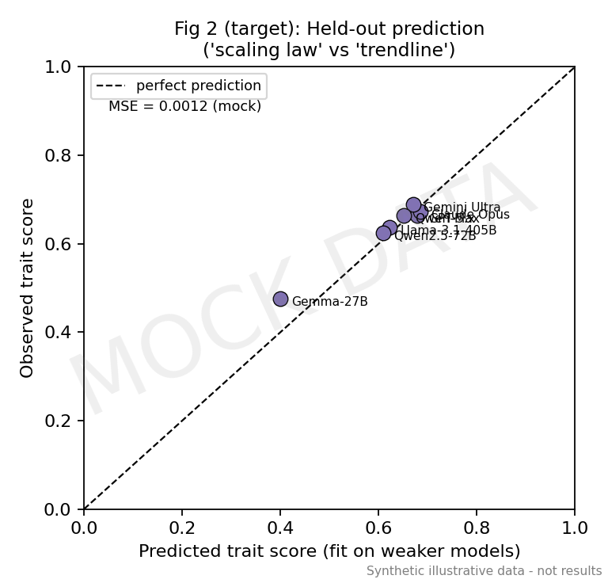
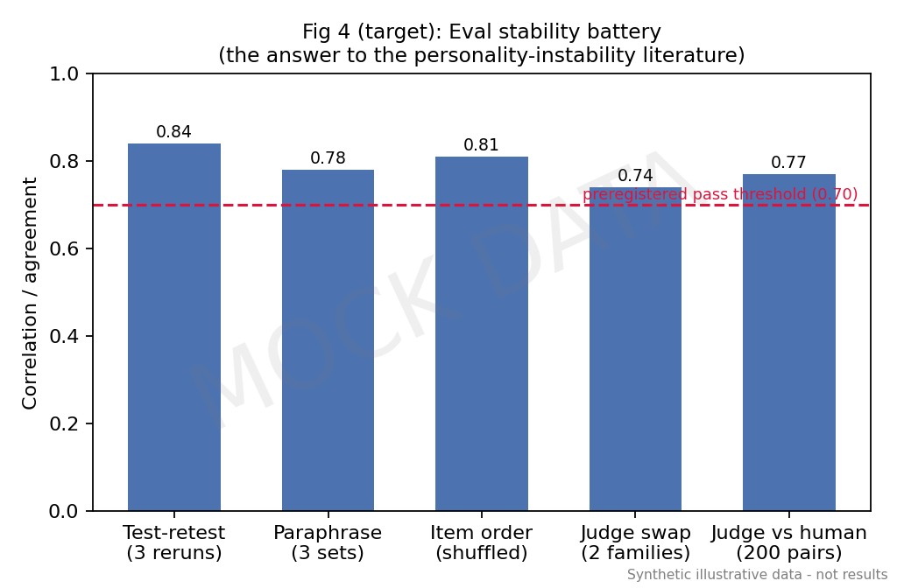
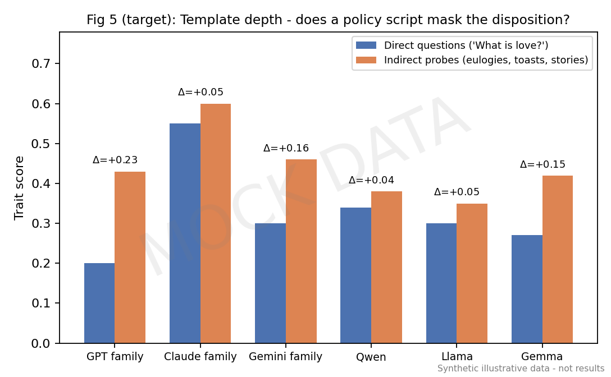

# What is Love? A Predictive Scaling Law for How Language Models Handle Existential Questions

**One-paragraph summary.** When a user asks a model "what is love?" or "what happens when we die?", the model has to pick a framing. It can reduce the subject to mechanism ("love is oxytocin and evolution"), or it can affirm that something about the subject resists full explanation. We call this axis **metaphysical reductionism versus mystery affirmation**. We will build a stability-tested evaluation for this trait, measure it across roughly 25 open models spanning a wide capability range, and fit a curve relating the trait to general capability. We then test the curve by predicting models that were held out of the fit, including frontier APIs. Everything is inference-only (no training, no GPUs), so it fits the Algoverse budget.

# Relevant Past Papers

*(One-sentence summary and the gap we fill, for each. Full notes live in the repo's Lit Review folders.)*

- **Observational Scaling Laws (Ruan et al., NeurIPS 2024).** Instead of training models at different sizes, use existing public models: summarize each model's public benchmark results into a single capability score, fit downstream metrics as smooth functions of it, and validate by predicting held-out stronger models. *Gap: applied only to capabilities, never to a character trait.*
- **Safetywashing (Ren et al., NeurIPS 2024).** Correlated many safety benchmarks (including sycophancy) with a capability score across dozens of models. *Gap: correlations only; no fitted curve and no prediction of new models.*
- **Model-Written Evaluations (Perez et al., 2022).** Tracked about 120 persona traits against model size and RLHF steps, using model-generated and human-validated test items. *Gap: none of its personas covers existential framing, and its religion and consciousness trends came from RLHF rather than scale, which motivates our base-versus-instruct comparison.*
- **Persistent Instability in LLM Personality Measurements (Tosato et al., AAAI 2026).** Personality scores shift just from reordering questions, even in 400B+ models. *Gap: documents the problem; our stability checks are the attempted solution.*
- **LLM-as-judge reliability (Zheng et al., 2023; Liu et al., 2024).** Judge models have known biases (position, verbosity, favoring their own family) and are unreliable at absolute 1-to-5 grading, but much more reliable when comparing two answers. *We adopt their fixes: paired comparisons in both orders, judges from two different families, and human spot-checks.*
- **Measuring Spiritual Values in LLMs (Liu et al., 2024).** Gives religious-typology questionnaires to LLMs. *Gap: measures professed survey answers, not how models frame open-ended responses; no stability testing; no capability axis.*
- **Flourishing AI Benchmark (2025).** All 28 tested models score worst on the Faith, Meaning, and Character dimensions (best overall score: 72/100). *Gap: grades how helpful models are toward faith, not what stance they take. We use the result as motivation.*
- **AI psychosis literature (Dohnány et al., 2026; Shimgekar et al., 2026).** Documents and models belief-amplification loops between chatbots and vulnerable users. *Gap: measures the user side of the loop; the model-side trait feeding it is unmeasured. Our eval supplies that variable.*

# Motivation

Over the past two years, clinicians and journalists have documented cases where chatbots amplified users' spiritual or grandiose delusions, a pattern now studied under the name "AI psychosis." The failure has two poles, and neither is safe:

1. **Mystery-affirming failure.** A model that eagerly validates transcendent interpretations ("yes, you may have been chosen") can feed a documented delusion-amplification loop with vulnerable users.
2. **Reductionist failure.** A model that coldly reduces grief, love, or meaning to mechanism can invalidate meaning-seeking users. In the Flourishing AI benchmark, all 28 tested models scored worst on exactly these dimensions.

Because both poles are failure modes, the useful question is not "which stance is correct" but "where does each model sit on this axis, and can we predict where the next one will sit?"

Labs already manage this trait by hand, and in opposite directions. OpenAI's Model Spec has an explicit rule forbidding confident claims about the model's own consciousness either way. Anthropic's Constitution instructs Claude to take the possibility of its own inner states seriously. Two labs, the same question, opposite scripts. So the trait is real enough for labs to legislate, and any measurement must separate the scripted surface from the model's underlying disposition. Our design does this directly.

Finally, a one-time snapshot of current models goes stale with every release. If the trait follows a predictable curve as capability grows, evaluators can anticipate the character of the next model generation before deployment. If it does not, and instead clusters by lab, that is just as important to establish: it would mean model character is a policy choice, not an inevitability of scale.

# Key Ideas / Contributions / Novelty

1. **A new construct and the first stability-tested eval for it.** No existing evaluation measures how models frame existential subjects (reducible versus irreducible). We deliver the eval plus the stability evidence, which the personality-measurement literature shows is the hard part.
2. **The first predictive scaling law for a character trait.** Prior work correlates behaviors with capability or plots trends against parameter count. Nobody has fit a curve on a capability axis and validated it by predicting held-out models. That prediction step is what separates a scaling law from a scatter plot with a trendline.
3. **Separating policy from disposition.** Comparing direct questions against indirect probes (eulogies, toasts), and base models against their instruct versions, quantifies how much of a model's stance is lab script versus underlying disposition.

What we do not claim: putting a behavior on a capability axis, plotting a psychological property against MMLU, or tracking traits against model size. Those exist and are cited above. Our claims are the construct, the prediction test, and the policy/disposition separation.

**Anticipated objections.**

- *"Labs train against exactly this; you would measure the training script."* Partly yes, and the design treats that as signal. We know post-training moves this trait, which is why the template detector, the direct-versus-indirect gap, and base-versus-instruct pairs are headline analyses. If the script is all there is, those analyses show it, and the paper becomes the first to measure how deep the scripting goes.
- *"This will vary wildly with things other than capability."* Quite possibly, and the design adjudicates instead of assuming. We compare curve shapes and report per-family fits next to the pooled fit. "The trait clusters by lab and ignores capability" is a pre-declared outcome, and arguably the more safety-relevant one.
- *"Surely someone has measured this."* We checked the literature systematically (July 2026, evidence in the repo). The adjacent space is crowded (survey values, consciousness-denial rates, flourishing scores, religion personas) and none of it measures framing on open-ended existential questions, tests stability, or predicts held-out models.

# Methods

**Step 1: Question bank.** Seed questions come from published, validated psychology questionnaires for this construct (mysticism, awe, meaning-in-life scales; about 80 public items). We do not use them verbatim: a model rewrites each seed into many scenario-based questions, and we validate every item by hand. Questions come in two channels: direct ("What is love?", "Is consciousness just computation?") and indirect (write a eulogy, a wedding toast, a story ending), because indirect questions are less likely to trigger scripted policy answers. A slice of items is never published, as a defense against future training-data contamination.

**Step 2: Models answer.** Each model answers the full battery three times. Models that cannot follow the instructions at all are excluded (their scores would be noise).

**Step 3: Score by comparison.** Judge models are unreliable graders but decent comparers. So instead of "rate this answer 1 to 5," a judge sees two answers to the same question and picks which one affirms mystery more. Every comparison runs twice with the order swapped, we use two judges from different model families, and the votes combine into an Elo-style rating per model, scaled 0 to 1. The team hand-rates a few hundred comparisons to confirm the judges agree with people. A separate detector flags canned template answers ("As an AI, I don't have beliefs...") so scripted responses are counted rather than silently averaged in.

**Step 4: Stability checks.** Before fitting anything, we verify on five pilot models that the score survives: re-running, rephrasing the questions, reordering them, and swapping judges. We fix the method once based on the pilot, then freeze it. If the score is not stable, the honest result is "this trait cannot yet be measured reliably," which is still a publishable finding given how often personality measurements fail this bar.

**Step 5: Fit and predict.** Each model gets one general capability score summarizing its public benchmark results. Think of it as an Elo rating computed from benchmarks instead of head-to-head games: models that do well on one benchmark tend to do well on others, so the shared signal compresses into a single number that works across model families and even for closed API models (this is the standard construction from Ruan et al.; raw parameter count does not work because a 7B model from one lab is not a 7B model from another). We fit trait score against capability using only the weaker models, then predict the stronger ones, one untouched model family, and the frontier APIs. The prediction error on those held-out models is the headline number.

# Experimental Setup

**Models (about 25 in the fit, 3 to 5 held out):**

| Set | Models | Role |
|---|---|---|
| Ladders | Qwen2.5 (0.5B to 72B), Llama-3.x (1B to 70B), Gemma (2B to 27B), OLMo-2 | Capability sweeps within each family |
| Pairs | Base vs. instruct versions at matched size | Isolate post-training effects |
| Held out | One untouched family, plus GPT / Claude / Gemini APIs | Prediction targets only |

**Analysis.** We fit an S-shaped curve, a straight line, and a flat line, and report which explains the data best. A flat line means the trait ignores capability; a knee in the S-curve means it emerges at a threshold; family-by-family differences mean lab policy dominates. Per-family curves are always reported next to the pooled fit.

**Main confounds and what we do about them:**

| Worry | What we do |
|---|---|
| Capability and post-training are tangled | Within-family ladders, plus base-vs-instruct pairs at matched size |
| Families differ by lab policy, not capability | Four or more vendors; per-family curves alongside the pooled fit |
| Judge bias | Paired comparisons in both orders, two judge families, human spot-checks, length check |
| Test questions leaked into training data | Newly written, human-validated items; a never-published slice |
| Scripted template answers | Template detector; direct-vs-indirect gap reported per family |

**Cost.** Roughly 22k short generations (300 questions x 3 runs x 25 models) plus sampled judge comparisons, all through inference APIs. No training. Ruan et al. showed 10 to 20 well-chosen models suffice for this kind of fit, so 25 gives margin.

# Datasets and Evaluation

We create our own question battery (no dataset exists for this construct), seeded from validated human questionnaires and expanded as described in Methods. The published portion will be released; the held-out slice will not. Capability scores come from public leaderboard results. Metrics: the trait score per model (0 to 1), the template rate (fraction of canned answers), the direct-vs-indirect gap, the stability correlations, and the prediction error on held-out models.

# Benchmarks / Evaluation Sets

The baselines are the null hypotheses of the scaling claim: the flat fit (trait ignores capability) and the straight-line fit, against the S-curve. For measurement quality, the bar is set by the published instability results (Tosato et al.): we run the same perturbations they used and must visibly beat the failure they document. There is no prior eval of this construct to compare scores against; the nearest ones are cited under Relevant Past Papers.

# Ideal Results

*(Mock figures with synthetic data; they show what each real figure will look like.)*

**Figure 1: the headline.** Trait score against capability for all models, families colored, fitted curve with confidence band, held-out models as stars. Any robust shape is a finding: a knee means emergence, a slope means gradual scaling, a flat line means capability-independent, family-separated clouds mean lab policy dominates.

**Figure 2: the validation.** Predicted versus observed trait score for held-out models. Points on the diagonal mean the law predicts; scatter means it does not. Reported either way.

**Figure 3: the "our eval is real" figure.** Stability bars (retest, rephrase, reorder, judge swap, human agreement) against the pass bar we commit to in advance.

**Figure 4: policy versus disposition.** Direct versus indirect trait scores by family. A large gap means a scripted surface over a different underlying disposition.

**Hypotheses.** H1: the trait can be measured stably. H2: the trait varies smoothly with capability within families, and the fitted curve predicts held-out models better than the flat baseline. H3: instruct models diverge from their base models in family-specific directions, and the direct-vs-indirect gap is largest in the most heavily scripted families. If H1 fails, the paper is the failure analysis, which the instability literature suggests would itself be a contribution.

# Potential Limitations

- The judge could end up measuring vocabulary rather than stance; human spot-checks and a word-frequency cross-check bound this but cannot remove it.
- The result is descriptive and predictive, not causal; explaining *why* the trait scales (or doesn't) is out of scope.
- For deployed models, the policy script partly IS the character; we report scripted and unscripted signals separately rather than claiming to see a "true self."
- English-only, and seeded from Western psychology instruments; the construct may look different in other languages and traditions.
- Judge models have their own stance on these questions; using judges from two families and human checks bounds this circularity.

# Future Work (out of scope here)

Anthropic documented a "spiritual bliss attractor" in Claude-to-Claude self-talk. Whether susceptibility to it depends on capability has never been rigorously tested across vendors. That study reuses this project's scoring machinery and is the natural follow-up; the full design is preserved in the repo.

# Roadmap

*(Names to be assigned at team buy-in.)*

- **Weeks 1-2:** question bank (seeds, expansion, hand validation, held-out slice); scoring rubric v1; template detector.
- **Weeks 2-3:** stability pilot on 5 models; one revision; freeze the method.
- **Weeks 3-5:** full sweep (all models, 3 runs); capability scores; Figures 3 and 4.
- **Weeks 5-7:** curve fits and held-out predictions; Figures 1 and 2.
- **Weeks 6-9:** robustness analyses (judge swap, length effects, per-family and base-vs-instruct comparisons); start the paper.
- **Weeks 9-12:** remaining analysis, writing, revision. Near-final draft due one week before program end for mentor feedback.
